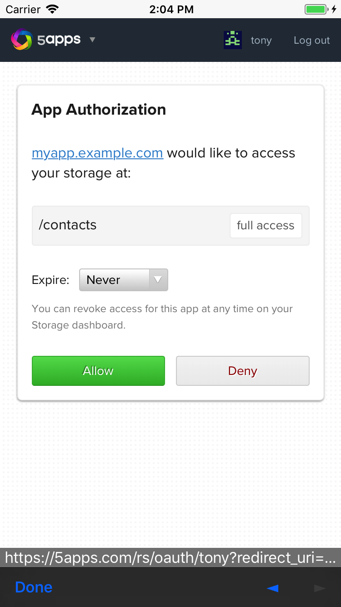

Usage in a Cordova app
======================

To use remoteStorage.js in a Cordova app, you need to have the `InAppBrowser plugin
<https://cordova.apache.org/docs/en/latest/reference/cordova-plugin-inappbrowser/>`_
installed.

Then you configure a redirect URL for your app, either by calling

.. code:: javascript

   remoteStorage.setCordovaRedirectUri('https://myapp.example.com');

or as config when creating your rs instance:

.. code:: javascript

   const remoteStorage = new RemoteStorage({ cordovaRedirectUri: 'https://myapp.example.com' });

When a user connects their storage, the OAuth dialog will open in an
in-app browser window, showing the URL for security reasons.

After the user authorized the app, the storage provider
will redirect to the configured redirect URL with the authorization
token added as a parameter. The remoteStorage library will intercept
this redirect, extract the token from the URL and close the window.

So the user doesn't actually see the page of the redirect URL and it
does't need to have the remoteStorage.js library included or have any
special logic at all. But you should still make sure that it can be
identified as belonging to your app. Storage providers will most likely
show the URL in the OAuth dialog, and some might even link to it (e.g.
from the list of connected apps).

