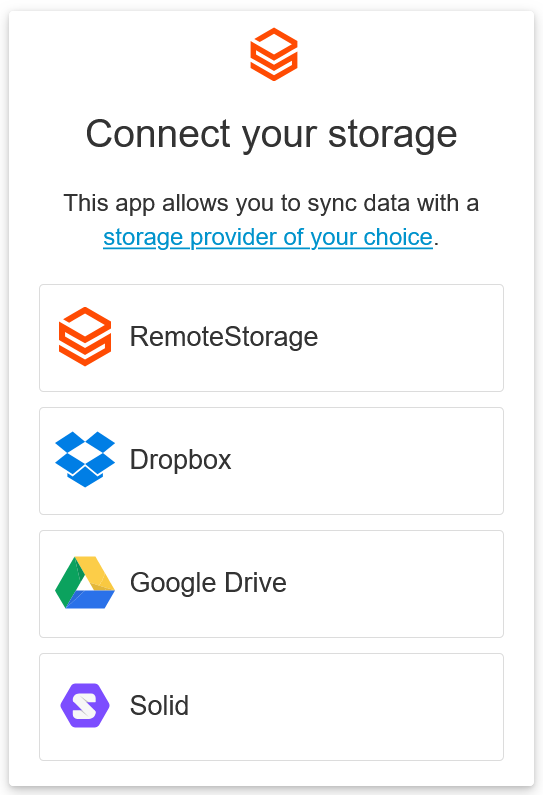

# Offering Dropbox and Google Drive storage options

{width="50%"}

rs.js has optional support for syncing data with Dropbox and Google
Drive instead of a RemoteStorage server.

There are a few drawbacks, mostly sync performance and the lack of a
permission model. So apps can usually access all of a user's storage
with these backends (vs. only relevant parts of the storage with RS
accounts). However, while RS is not a widely known and deployed
protocol, we find it helpful to let users choose something they already
know, and potentially migrate to an RS account later on.

For these additional backends to work, you will have to register your
app with Dropbox and/or Google first. Then you can configure your OAuth
app ID/key like so:

```js
remoteStorage.setApiKeys({
  dropbox: 'your-app-key',
  googledrive: 'your-client-id'
});
```

::: info
The [Connect widget](getting-started/connect-widget) will automatically show
only the available storage options, based on the presence of the Dropbox and
Google Drive API keys. RemoteStorage is always enabled.
:::

## Dropbox

An app key can be obtained by [registering your
app](https://www.dropbox.com/developers/apps).

Create a new "scoped" app for the "Dropbox API", with these scopes:

- `account_info.read`
- `files.metadata.read`
- `files.metadata.write`
- `files.content.read`
- `files.content.write`
- `sharing.read`
- `sharing.write`

::: warning
The `sharing.read` and `sharing.write` scopes are required for generating
shared links via [`getItemURL()`][1] (see
[Sharing public files via Dropbox](#sharing-public-files-via-dropbox)).

If you are upgrading an existing integration, you **must** enable these two
scopes on the "Permissions" tab of your app in the
[Dropbox App Console](https://www.dropbox.com/developers/apps), otherwise
Dropbox will reject new authorization requests with an `invalid_scope` error.
Existing users will need to re-authorize your app after you enable the scopes.
:::

You need to set one or more OAuth2 redirect URIs for all routes a user can
connect from, for example `http://localhost:8000` for an app you are developing
locally. If the path is '/', rs.js drops it.

### Known issues

- Storing files larger than 150MB is not yet supported
- Listing and deleting folders with more than 10000 files will cause
  problems
- Content-Type is not fully supported due to limitations of the
  Dropbox API
- Dropbox preserves cases but is not case-sensitive

## Google Drive

A client ID can be obtained by registering your app in the [Google Developers
Console](https://console.developers.google.com/flows/enableapi?apiid=drive).

- Create an API, then add credentials for Google Drive API. Specify
  you will be calling the API from a "Web browser (Javascript)"
  project. Select that you want to access "User data".
- On the next screen, fill out the Authorized JavaScript origins and
  Authorized redirect URIs for your app (for every route a user can
  connect from, same as with Dropbox)
- Once your app is running in production, you will want to get
  verified by Google to avoid a security warning when the user first
  connects their account

### Known issues

- Sharing public files is not supported yet (see [issue 1051](https://github.com/remotestorage/remotestorage.js/issues/1051))
- [`getItemURL()`][1] is not implemented yet (see [issue 1054](https://github.com/remotestorage/remotestorage.js/issues/1054))

## Sharing public files via Dropbox

[`BaseClient.getItemURL()`][1] is supported for the Dropbox backend. It returns a
Dropbox shared link URL for files stored under the `/public/` folder, creating
one via the Dropbox API on first request and caching it in `localStorage` for
subsequent calls.

### Getting the raw file URL

The shared link returned by Dropbox for a file is, by default, an **HTML
preview page** (a "shared link" view in the Dropbox web UI), not the raw file
content. This is fine for sharing a link with a human, but it does not work
when you need to embed the file directly, for example inside an `` tag,
an `<audio>` element, or a fetch request for binary data.

To get the **raw file** URL, replace the `?dl=0` query parameter on the shared
link with `?raw=1`:

```js
const url = await client.getItemURL('public/images/photo.jpg');

let rawUrl = url;
if (url && url.includes('dropbox.com')) {
  rawUrl = url.replace('dl=0', 'raw=1');
}

// Now safe to use in an  src, fetch(), etc.
element.style.backgroundImage = `url('${rawUrl}')`;
```

::: tip
This `dl=0` → `raw=1` substitution is specific to Dropbox shared links and is
not part of the rs.js API. It is a workaround for Dropbox's default behavior
of serving a preview page. Apps targeting both remoteStorage and Dropbox
backends should check the URL host before applying the substitution, as shown
above.
:::

[1]: ../api/baseclient/classes/BaseClient#getitemurl
