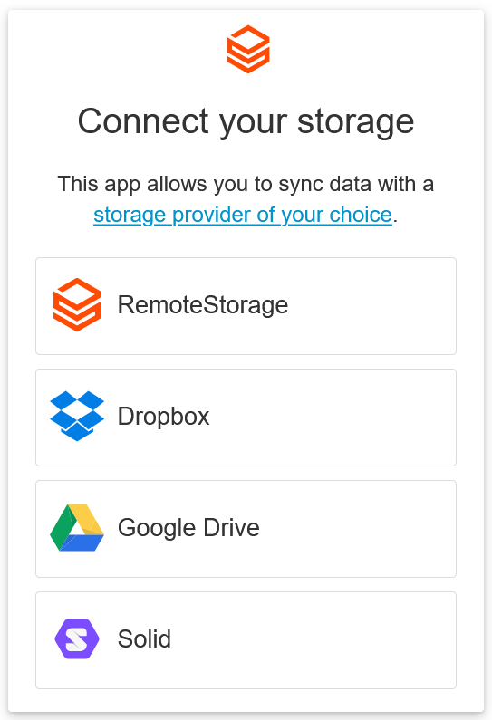

# Offering Dropbox, Google Drive, and Solid storage options

{width="50%"}

rs.js has optional support for syncing data with Dropbox, Google
Drive, and Solid instead of a RemoteStorage server.

There are a few drawbacks, mostly sync performance and the lack of a
permission model. So apps can usually access all of a user's storage
with these backends (vs. only relevant parts of the storage with RS
accounts). However, while RS is not a widely known and deployed
protocol, we find it helpful to let users choose something they already
know, and potentially migrate to an RS account later on.

For these additional backends to work, you will have to register your
app with Dropbox and/or Google first. Then you can configure your OAuth
app ID/key like so:

```js
remoteStorage.setApiKeys({
  dropbox: 'your-app-key',
  googledrive: 'your-client-id'
});
```

::: info
The [Connect widget](getting-started/connect-widget) will automatically show
only the available storage options, based on the presence of the Dropbox and
Google Drive API keys. RemoteStorage is always enabled.
:::

For the Solid backend you have to specify the available authentication URLs
for the user to choose from on the connect widget's configurations. Once
configured, it will also show Solid as an available storage option. Like so:

```js
const config = {
    solidProviders: {
        providers: [
            Widget.SOLID_COMMUNITY,
            Widget.INRUPT
        ],
        allowAnyProvider: true
    }
};
const widget = new Widget(remoteStorage, config);
```

## Dropbox

An app key can be obtained by [registering your
app](https://www.dropbox.com/developers/apps).

Create a new "scoped" app for the "Dropbox API", with these scopes:

- `account_info.read`
- `files.metadata.read`
- `files.metadata.write`
- `files.content.read`
- `files.content.write`

You need to set one or more OAuth2 redirect URIs for all routes a user can
connect from, for example `http://localhost:8000` for an app you are developing
locally. If the path is '/', rs.js drops it.

### Known issues

- Storing files larger than 150MB is not yet supported
- Listing and deleting folders with more than 10000 files will cause
  problems
- Content-Type is not fully supported due to limitations of the
  Dropbox API
- Dropbox preserves cases but is not case-sensitive
- `getItemURL` is not implemented yet (see issue 1052)

## Google Drive

A client ID can be obtained by registering your app in the [Google Developers
Console](https://console.developers.google.com/flows/enableapi?apiid=drive).

- Create an API, then add credentials for Google Drive API. Specify
  you will be calling the API from a "Web browser (Javascript)"
  project. Select that you want to access "User data".
- On the next screen, fill out the Authorized JavaScript origins and
  Authorized redirect URIs for your app (for every route a user can
  connect from, same as with Dropbox)
- Once your app is running in production, you will want to get
  verified by Google to avoid a security warning when the user first
  connects their account

### Known issues

- Sharing public files is not supported yet (see issue 1051)
- `getItemURL` is not implemented yet (see issue 1054)

## Solid

An authentication URL must always have been set on the Solid backend before
calling `connect()`. You can do so by calling `setAuthURL()` first.

The connect widget accepts a list of authentication URLs as configuration
and automatically sets it on the Solid backend when selected.

Each option consists of two keys: `authURL` which is the authentication URL
to connect to. And a `name` to be displayed on the widget. The
`allowAnyProvider` option if set to `true`, adds an input box to the widget
to allow the user to type any authentication URL of their choosing.

::: info
The Solid backend exposes the connected session. It is the `Session` object
from the [Inrupt](https://docs.inrupt.com/developer-tools/javascript/client-libraries/)
Solid library. It can be accessed by calling `remoteStorage.solid.getSession()`
only after the backend is connected.
:::
